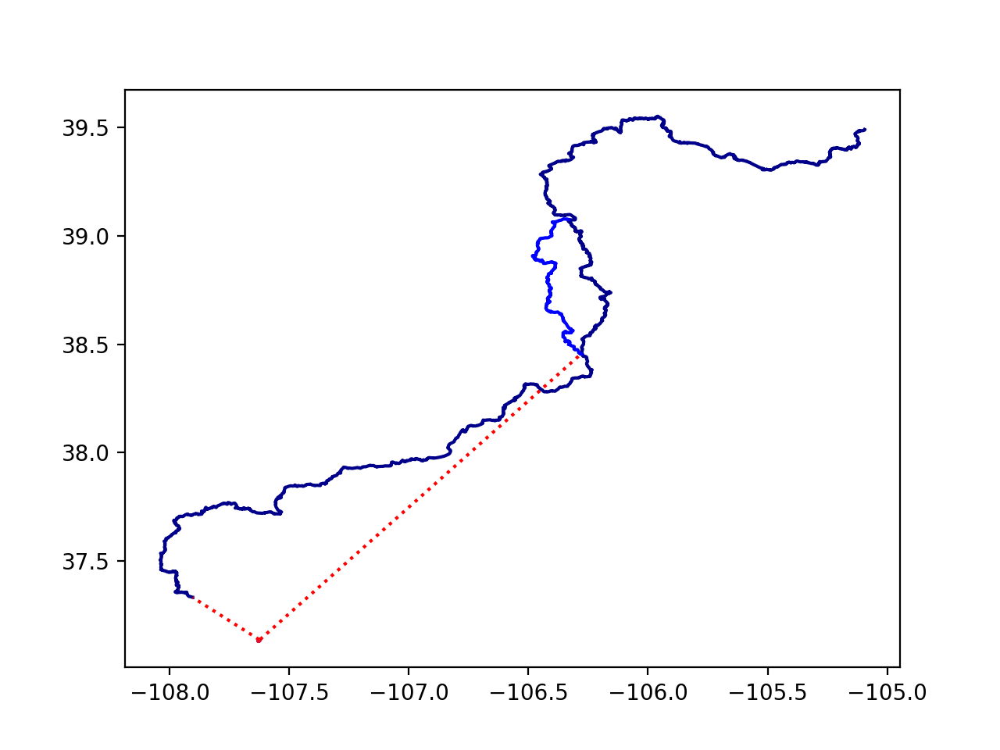

# Wildfire Data Analysis with Python

This project was inspired by a close call with a wildfire while hiking the PCT in 2021. It scrapes fire location data from the National Interagency Fire Center and relates it to gps data of a hiking trail (in this case the Colorado Trail but with potential adaptations for other National Scenic Trails).\
Data can be received as an SMS message either with a cell phone or off-grid satellite communication device. This project is intended to be expanded to a mobile-friendly website so hikers can check nearby fires when they have cell service, or request updates via satellite when they are without service.\
\
(image showing closest points on trail to two active wildfires)

